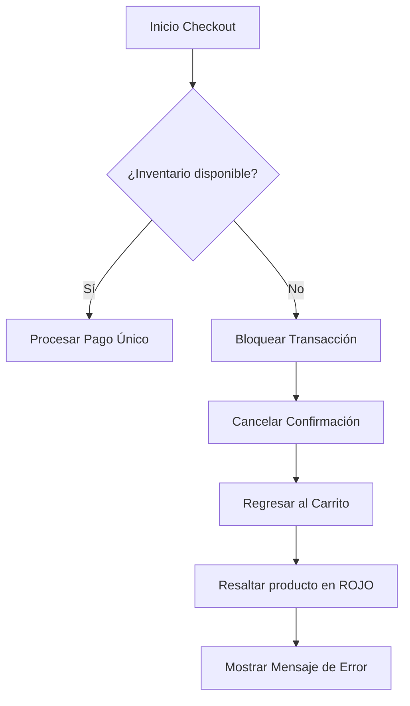
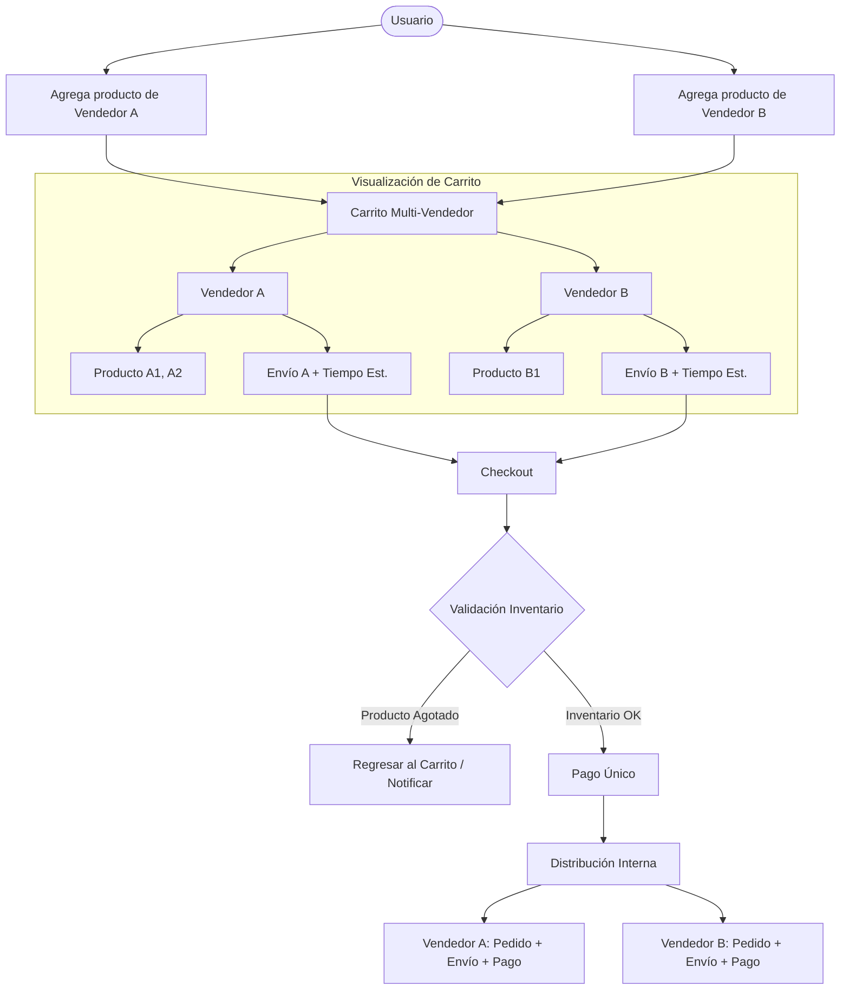

# Documento de Requisitos de Producto (PRD)

## INTEGRATES

* JUAN DAVID MARTINEZ PERDOMO
* DAYID ESTEBAN MADERA PAEZ

---

##  1. Información General

### 1.1 Nombre del Proyecto
**`Multi-Vendor Checkout`**

### 1.2 Problema
Actualmente, cuando un usuario desea comprar un artículo del **Vendedor A** y otro del **Vendedor B**, debe realizar **dos transacciones y procesos de pago independientes**.

Esta experiencia genera:
*  **Fricción significativa** durante el proceso de compra.
*  **Reducción del Ticket Promedio de Compra (AOV)**.
*  **Aumento de costos** asociados al procesamiento de pagos.

### 1.3 Solución
Implementar un **carrito multi-vendedor** que permita agrupar productos de diferentes tiendas dentro de una misma sesión de compra y procesar todos los productos mediante una **única transacción**.

>  **Nota:** Aunque el pago será único, los procesos logísticos y operativos continuarán siendo independientes para cada vendedor.

---

##  2. Objetivos de Negocio

### 2.1 KPIs
| KPI | Objetivo | Periodo de Medición |
| :--- | :---: | :---: |
| **Ticket Promedio de Compra (AOV)** | `+15%` | Primeros 90 días |
| **Abandono del Carrito** | `-8%` | Primeros 90 días |

### 2.2 Beneficios Esperados
*  **Reducir la fricción** del proceso de checkout.
*  **Aumentar la cantidad de productos** por transacción.
*  **Incrementar el valor promedio** de cada compra.
*  **Reducir operaciones** de pago independientes.
*  **Mejorar la experiencia de compra** multi-vendedor.

---

##  3. Alcance

### 3.1 Incluido en Fase 1
- [x] Carrito con productos de múltiples vendedores.
- [x] Agrupación visual de productos por vendedor.
- [x] Cálculo independiente de costos de envío.
- [x] Cálculo independiente de tiempos estimados de entrega.
- [x] Checkout mediante una única transacción.
- [x] Validación de inventario previa al pago.
- [x] Notificación independiente para cada vendedor.
- [x] Liquidación independiente del importe correspondiente a cada vendedor.
- [x] Eliminación individual de productos.
- [x] Funcionalidad "Guardar para más tarde".

### 3.2 Fuera de Alcance (Fase 1)
En esta fase **no se permitirá consolidar los envíos** de diferentes vendedores en un único paquete físico. 

Si los vendedores se encuentran en ciudades diferentes:
*  Los productos se enviarán por separado (*múltiples paquetes*).
*  Los costos de envío serán independientes.
*  Los tiempos de entrega serán independientes.
*  Cada vendedor gestionará su propio despacho.

---

## 👤 4. Historias de Usuario

### `US-01` — Carrito multi-vendedor
> **Como** comprador,  
> **quiero** agregar productos de diferentes tiendas a mi carrito,  
> **para** pagar todo junto en una sola transacción.

<b>Criterios de Aceptación</b>

- [x] El usuario puede agregar productos de diferentes vendedores.
- [x] Los productos permanecen dentro del mismo carrito.
- [x] Los productos se agrupan visualmente por vendedor.
- [x] El usuario puede realizar un único proceso de checkout.
- [x] El pago se procesa mediante una única transacción.

---

### `US-02` — Desglose de envío
> **Como** comprador,  
> **quiero** ver el desglose de los costos de envío de cada vendedor antes de pagar,  
> **para** entender por qué varía el precio total.

<b>Criterios de Aceptación</b>

- [x] Cada vendedor debe mostrar su costo de envío.
- [x] Cada vendedor debe mostrar su tiempo estimado de entrega.
- [x] El total del carrito debe incluir los costos de envío correspondientes.
- [x] El usuario debe poder identificar qué costo corresponde a cada vendedor.

---

### `US-03` — Operación independiente del vendedor
> **Como** vendedor,  
> **quiero** recibir la notificación de venta y el dinero de mi producto de forma independiente,  
> **para** gestionar mi propio inventario y facturación sin enredarme con otras tiendas.

<b>Criterios de Aceptación</b>

- [x] Cada vendedor recibe una notificación de sus productos vendidos.
- [x] El vendedor recibe únicamente el importe que le corresponde.
- [x] La información de otros vendedores no debe mezclarse con su operación.
- [x] El inventario debe actualizarse de manera independiente.
- [x] La liquidación debe poder identificarse por vendedor.

---

##  5. Requisitos Funcionales

| ID | Requisito | Descripción / Criterios de Aceptación |
| :--- | :--- | :--- |
| **`RF-01`** | **Interfaz del carrito agrupada por vendedor** | Organizar visualmente los artículos según la tienda que los vende. • Nombre del vendedor como encabezado. • Productos debajo del encabezado. • Cada grupo muestra su **costo de envío** y **tiempo estimado**. • Permite eliminar o "guardar para más tarde" de forma individual. • Las acciones no alteran productos de otros vendedores. |
| **`RF-02`** | **Checkout multi-vendedor** | Procesar productos de múltiples tiendas en una sola transacción. • Identificar vendedor por producto. • Calcular subtotal e importe por vendedor. • Calcular costo de envío por vendedor. • Comprador realiza un único pago. |
| **`RF-03`** | **Distribución de la venta** | Separar internamente la operación post-pago. • Vendedor recibe sólo sus productos e importe. • Gestión de pedidos independiente. • Sin acceso a datos operativos de otros vendedores. |
| **`RF-04`** | **Validación de inventario** | Verificar disponibilidad previa al cobro. • Validar stock antes de confirmar la transacción. • Si falla un producto, bloquear transacción y volver al carrito. |

---

##  6. Manejo de Errores

### Producto agotado durante el Checkout

#### Comportamiento Esperado:
1. **Bloquear** la transacción y cancelar la confirmación del checkout.
2. **Regresar** al usuario a la pantalla del carrito.
3. **Identificar visualmente** el producto agotado (resaltar en color **rojo**).
4. **Mostrar el mensaje:**
   >  *"El artículo de la tienda X ya no está disponible. Modifica tu carrito para continuar".*

#### Resultado Esperado:
El usuario debe poder modificar su carrito y continuar con la compra sin perder la sesión.

---

##  7. Requisitos No Funcionales

| ID | Parámetro | Métrica / Criterio |
| :--- | :--- | :--- |
| **`RNF-01`** | **Rendimiento bajo carga** | Soportar **50.000 peticiones de checkout concurrentes por minuto** sin caídas de servicio durante eventos de alta demanda (CyberMonday). |
| **`RNF-02`** | **Tiempo de respuesta** | El cálculo y renderizado del subtotal de un carrito multi-vendedor debe ser **$\le$ 800 ms** bajo condiciones normales. |

---

##  8. Flujo Principal

---

##  9. Reglas de Negocio

1. Un carrito puede contener productos de múltiples vendedores.
2. Cada producto debe estar asociado a un único vendedor.
3. Cada vendedor mantiene su propia información logística (costos y tiempos de envío).
4. El comprador realiza **un único pago**.
5. La distribución contable y la notificación de la transacción se realizan de forma independiente por vendedor.
6. Si un solo producto requerido no tiene stock, **se impide la confirmación de todo el checkout**.
7. En Fase 1 **no se consolidan envíos** entre vendedores.

---

##  10. Criterios de Éxito (Primeros 90 Días)

- [ ] **AOV:** Incrementar un **+15%**.
- [ ] **Carrito Abandonado:** Reducir un **-8%**.
- [ ] **Capacidad:** Soporte garantizado de **50.000 req/min**.
- [ ] **Performance:** Tiempo de respuesta $\le$ 800 ms.
- [ ] **Operatividad:** 100% de separación correcta de pedidos y fondos por vendedor.

---

##  11. Fuera de Alcance Futuro (Fases Posteriores)

*  Consolidación física de envíos en un solo paquete.
*  Optimización automática de paquetes entre vendedores.
*  Agrupación logística por ciudad.
*  Optimización de costos de envío multi-vendedor.
*  Nuevas estrategias de distribución y liquidación financiera.

---

##  12. Versionado y Estado

| Versión | Fecha | Estado | Descripción |
| :---: | :---: | :---: | :--- |
| **`1.0`** | `2026-09-03` | `Draft` | Versión inicial / Fase 1 |
